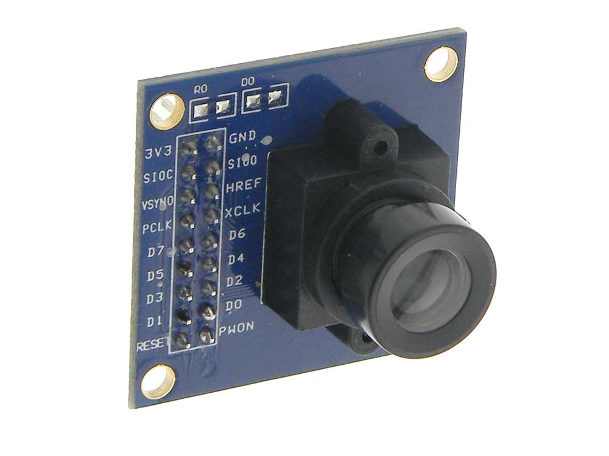
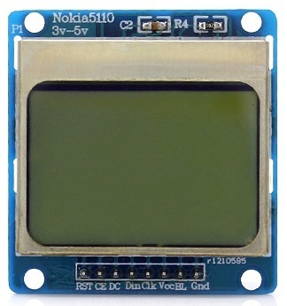

# ESP32 (LOLIN32) + OV7670 Camera + Nokia 5110 LCD

This project used Arduino IDE for getting frames from OV7670 camera
module and display it on the monochrome LCD of Nokia 5110.

## Parts

  - LOLIN32 ESP32-based board
  
    

  - OV7670 camera module
  
    

  - Nokia 5110 LCD module
  
    

## Instructions

Open `Main.ino` in Arduino IDE and upload it to your board.

## Drivers

  - Driver for OV7670 camera found at:
    
    <https://github.com/bitluni/ESP32CameraI2S>

  - Driver for Nokia 5110 LCD found at:
    
    <https://github.com/platisd/nokia-5110-lcd-library>

## Demo

